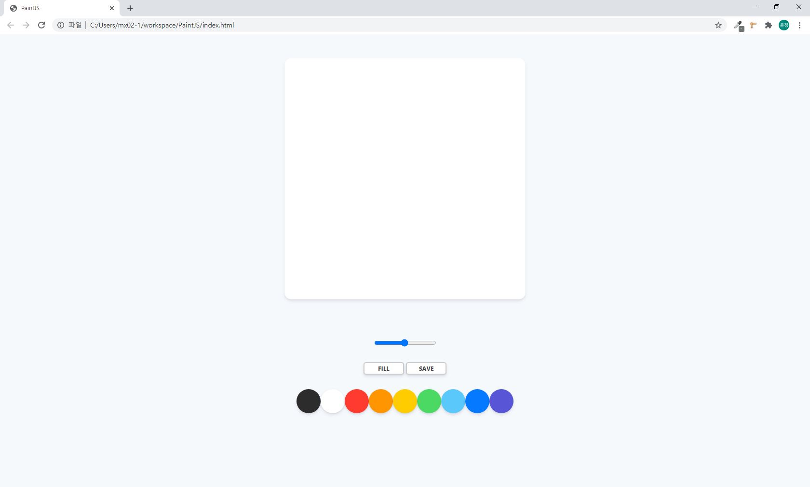
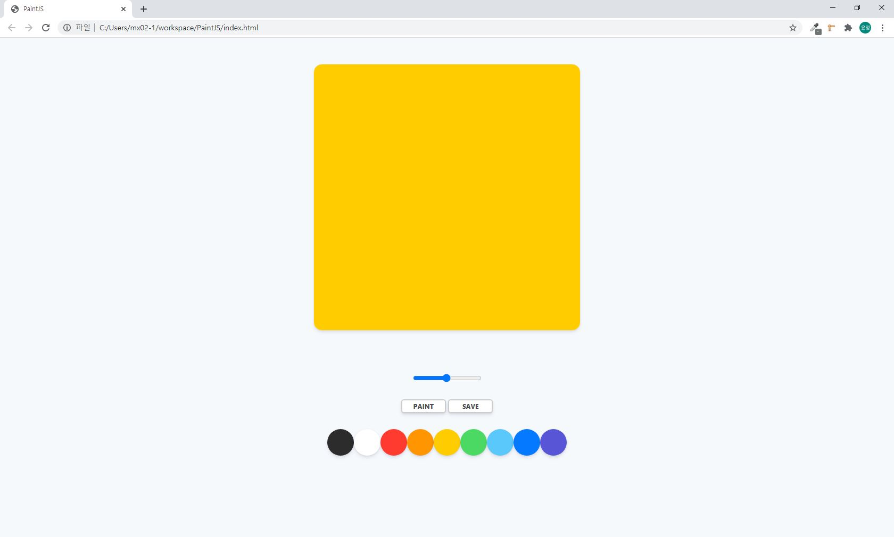
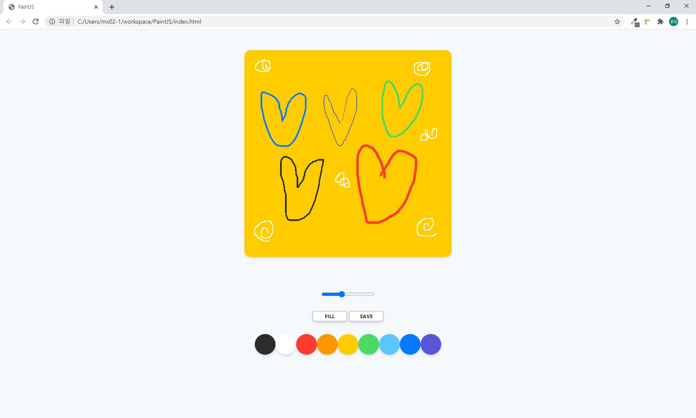
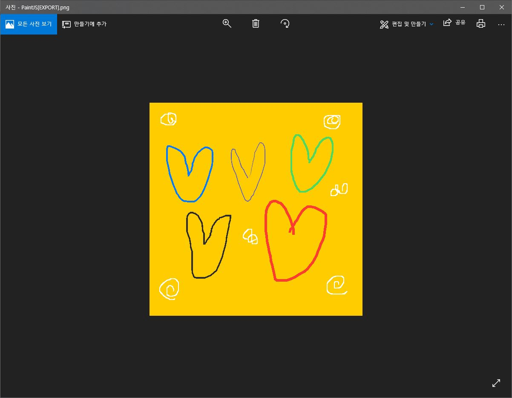

# 그림판 프로그램
## 프로젝트 소개

HTML, CSS, 바닐라JS으로 작성한 그림판 프로그램입니다. 
 
 

## 개발 인원

1명(개인 프로젝트)
 
 

## 개발 기간

2020.07.21(1일)
 
 

## 핵심 기능

- 캔버스에 그림 그리기
- 색상과 굵기 조절 가능
- 색상을 이용해 배경색 넣기
- png로 파일 저장하기
 
 

## 개발 환경

- 개발환경 : Windows 10 Enterprise x64
- 개발도구 : vscode, Github
- 구성환경 : HTML, CSS, Vanilla js

 
 

## 실행 스크린 샷

메인 페이지 입니다.

  

색상을 클릭해 배경을 채운 모습입니다.

  

브러쉬의 굵기와 색상을 다양하게 이용하여 그린 모습입니다.

 
 

SAVE를 클릭하여 png확장자로 저장한 모습입니다.

 
 

## 참고
[노마드코더](https://www.youtube.com/channel/UCUpJs89fSBXNolQGOYKn0YQ)
